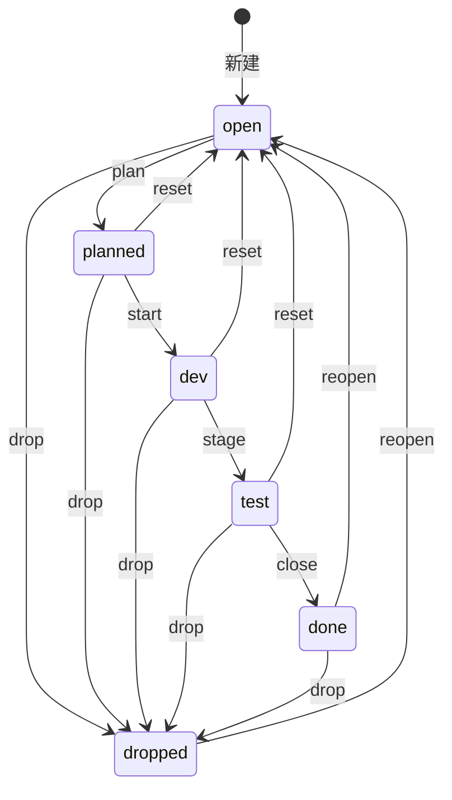

# 领域概念词汇表

> 本文档记录 mint 项目已引入的领域概念。核心概念用英文标识符，配中文解释。
> 实现时以本文档定义为准；新增概念需在此登记。技术选型见 `decisions.md`。

---

## 核心概念

### Issue（条目）

mint 的基本单位：一个可执行的问题（problem）或需求（requirement），有独立生命周期。区别于"记忆"——issue 是**待办/已解决的**，可驱动后续开发决策。

| 字段 | 含义 |
|------|------|
| `id` | 自增主键 |
| `title` | 一句话标题（去重的依据） |
| `body` | 补充说明（可选，`--body`） |
| `kind` | `problem` \| `requirement`（默认 problem） |
| `status` | `open` \| `planned` \| `dev` \| `test` \| `done` \| `dropped` |
| `project_id` | 外键 → `projects(id)` |
| `test_cmd` | 测试命令/手法（close 必填）——记录"如何复现/复测" |
| `dropped_reason` | drop 理由（`--reason`，可空） |
| `created_at` | 创建时间 |
| `updated_at` | 最近更新时间（每次状态转换写入） |

**不做 `resolution`/`resolved_at`**：done 的解决方案看 commit message（0.2.0 起 git 关联后从 HEAD 读）。

### Project（项目）

来源项目。**是标签而非隔离边界**——单一全局库，`project_id` 关联；未来跨项目经 `refs` 互引。

| 字段 | 含义 |
|------|------|
| `id` | 自增主键 |
| `name` | UNIQUE，逻辑键 |
| `description` | 描述 |
| `git` | remote url（检测来源） |
| `abs_dir` | 首次注册时的绝对路径 |

**检测优先级**（0.1.0 实现）：git 库名 → dirname → 自定义(`--project`) → 兜底 `default`。add 时自动注册到 projects 表。

### Tag（标签）

自由创建的分类标记，便于快速分类查询。独立表 + 关联表（规范化，可索引）。

- `tags`：`name`(UNIQUE) + `description`
- `issue_tags`：`(issue_id, tag_id)` 复合主键，仅 `created_at`

CLI 内联 `--tag`（按 clap 框架能力，逗号/重复）；`mint tag list` 列出 name|description + issue 计数供 agent 学习含义（0.1.0 已接线）。

### 状态机（6 态）

`test` 状态语义 = **testing**（测试中/等待测试），非"测试完成"。

| 转换 | 触发 | 约束 |
|------|------|------|
| open → planned | `plan` | — |
| planned → dev | `start` | — |
| dev → test | `stage` | `--test-cmd` 填测试命令 |
| test → done | `close` | **`--test-cmd` 必填**；测试全绿才推进 |
| planned/dev/test → open | `reset` | 打回重做 |
| done/dropped → open | `reopen` | 重开；清空 `dropped_reason`（旧周期字段不再有意义） |
| 任意 → dropped | `drop` | 可附 `--reason` |

**CLI 形态**：状态动作全部在 `mint state` 命名空间下：`mint state plan <id>` / `mint state close <id> --test-cmd '...'` / `mint state drop <id> --reason '...'`。顶层命令仅 add/list/show/state/tag（`state` 释放了 `plan` 顶层名给 0.2.0 的 plan 容器）。**无配置文件**：配置走 CLI 参数 + 环境变量（统一 `MINT_` 前缀，如 `MINT_DB_PATH`）。

**无 dev→done 捷径**：跳过测试也要 `stage` 到 `test`，close 时 test_cmd 填 `not-tested`（用户侧英文值；中文语境下可写作"没测"）。此规则需写入未来 adapter 提示词。

### capture（捕获）

hook 事件的统一入口：接收 agent 传来的原始信号，做归一化、去重后入库。**归一化放 CLI 侧（`capture.rs`），不放 hook 侧**——hook 只做"检测信号 + 转发原始信息"的传声筒。**0.3.0 实现**（随 Claude 适配器）。

### context（上下文注入）

会话启动时生成注入文本（当前项目 open + 全局概览），让 agent 开箱即知当前待办。

### adapter（适配器）

每种 agent 一个适配器，把该 agent 的扩展机制（hooks/指令文件/MCP）接到本体的 `capture`/`context` 通用接口上。Claude Code 有真 hooks（全自动）；Codex/OpenCode 降级为"指令驱动的主动登记"。

### dedup（去重）

`add`/`capture` 时对未关闭状态（open/planned/dev/test）做标题模糊匹配，命中则 `hit_count+1` 并打印"已合并 #id"，未命中才新建。是系统长期不变成垃圾场的关键。**0.3.0 实现**。

### FTS（全文检索）

FTS5 外部内容表 + 触发器保持 `issues_fts` 与 `issues` 同步（INSERT/UPDATE/DELETE 自动维护）。**0.3.0 实现**。

---

## 与 mem-lite 的分工

| | mem-lite | mint |
|---|---------|------|
| 定位 | 事实/教训/记忆沉淀 | 可执行问题/需求 + 生命周期 |
| 写入 | 被动、自动 | 主动 + 自动捕获 |
| 查看 | 黑箱 | 白盒（CLI/TUI 可查） |
| 结构 | 通用 observation | 专为 issue 语义设计 |

交叉只通过 `refs` 互引（如 issue 里记 `memory#N`），不强耦合、不自动摘要。
