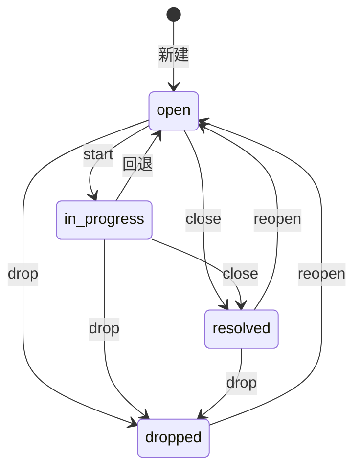

# 领域概念词汇表

> 本文档记录 mint 项目已引入的领域概念。核心概念用英文标识符，配中文解释。
> 实现时以本文档定义为准；新增概念需在此登记。

---

## 核心概念

### Issue（条目）

mint 的基本单位：一个可执行的问题（problem）或需求（requirement），有独立生命周期。区别于"记忆"——issue 是**待办/已解决的**，可驱动后续开发决策。

| 字段 | 含义 |
|------|------|
| `id` | 自增主键 |
| `title` | 一句话标题（去重的依据） |
| `body` | 补充说明 |
| `kind` | `problem` \| `requirement` |
| `status` | `open` \| `in_progress` \| `resolved` \| `dropped` |
| `project` | **标签**，非隔离边界——单一全局库，跨项目经 `refs` 互引 |
| `priority` | 1-3，默认 2 |
| `source` | 登记来源：`agent` / `capture` / `claude_hook` |
| `resolution` | 关闭说明（`close` 必填）——issue 系统区别于普通记忆的核心资产 |
| `hit_count` | 去重命中计数（默认 1） |
| `refs` | 关联：`project#commit` / `issue#N` / `memory#N` |

### 状态机

| 转换 | 触发 | 约束 |
|------|------|------|
| open → in_progress | `start` | — |
| open/in_progress → resolved | `close` | **必须带 `--resolution`** |
| open/in_progress/resolved → dropped | `drop` | 可附理由 |
| in_progress → open | 回退 | 交回 |
| resolved/dropped → open | `reopen` | 重新打开 |

### capture（捕获）

hook 事件的统一入口：接收 agent 传来的原始信号，做归一化、去重后入库。**归一化放 CLI 侧（`capture.rs`），不放 hook 侧**——hook 只做"检测信号 + 转发原始信息"的传声筒。

### context（上下文注入）

会话启动时生成注入文本（当前项目 open + 全局概览），让 agent 开箱即知当前待办。

### adapter（适配器）

每种 agent 一个适配器，把该 agent 的扩展机制（hooks/指令文件/MCP）接到本体的 `capture`/`context` 通用接口上。Claude Code 有真 hooks（全自动）；Codex/OpenCode 降级为"指令驱动的主动登记"。

### dedup（去重）

`add`/`capture` 时对 open/in_progress 做标题模糊匹配，命中则 `hit_count+1` 并打印"已合并 #id"，未命中才新建。是系统长期不变成垃圾场的关键。

### FTS（全文检索）

FTS5 外部内容表 + 触发器保持 `issues_fts` 与 `issues` 同步（INSERT/UPDATE/DELETE 自动维护）。

---

## 与 mem-lite 的分工

| | mem-lite | mint |
|---|---------|------|
| 定位 | 事实/教训/记忆沉淀 | 可执行问题/需求 + 生命周期 |
| 写入 | 被动、自动 | 主动 + 自动捕获 |
| 查看 | 黑箱 | 白盒（CLI/TUI 可查） |
| 结构 | 通用 observation | 专为 issue 语义设计 |

交叉只通过 `refs` 互引（如 resolution 里记 `memory#N`），不强耦合、不自动摘要。
