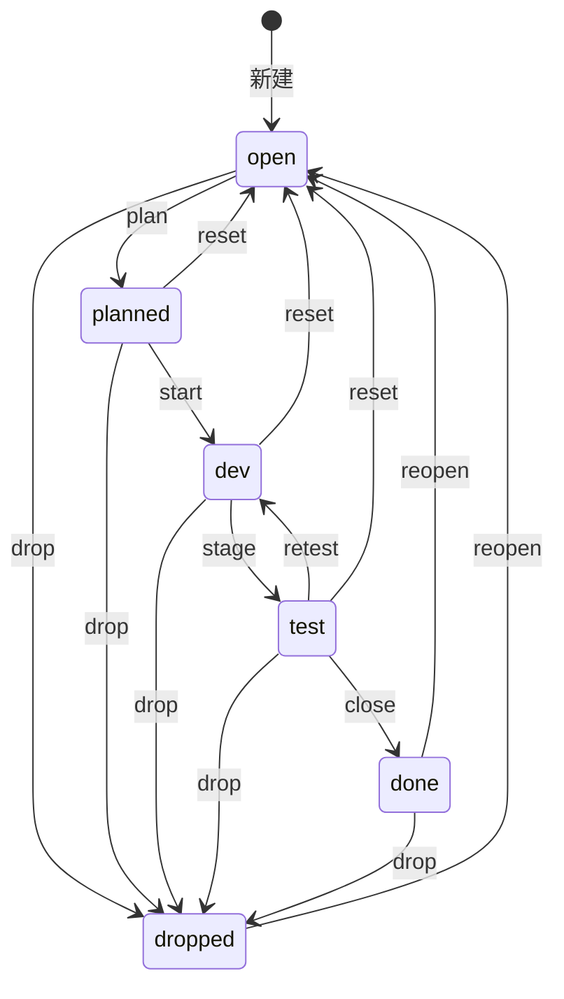

# 领域概念词汇表

> 本文档记录 mint 项目已引入的领域概念。核心概念用英文标识符，配中文解释。
> 实现时以本文档定义为准；新增概念需在此登记。技术选型见 `decisions.md`。

---

## 核心概念

### Issue（条目）

mint 的基本单位：一个可执行的问题（problem）或需求（requirement），有独立生命周期。区别于"记忆"——issue 是**待办/已解决的**，可驱动后续开发决策。

| 字段 | 含义 |
|------|------|
| `id` | 自增主键 |
| `title` | 一句话标题（去重的依据） |
| `body` | 补充说明（可选，`--body`） |
| `kind` | `problem` \| `requirement`（默认 problem） |
| `status` | `open` \| `planned` \| `dev` \| `test` \| `done` \| `dropped` |
| `project_id` | 外键 → `projects(id)` |
| `test_cmd` | 测试命令/手法（close 必填）——记录"如何复现/复测" |
| `dropped_reason` | drop 理由（`--reason`，可空） |
| `created_at` | 创建时间 |
| `updated_at` | 最近更新时间（每次状态转换写入） |

**不做 `resolution`/`resolved_at`**：done 的解决方案看 commit message（0.2.0 起 git 关联后从 HEAD 读）。

### Project（项目）

来源项目。**多 db 架构下为隔离边界**（D36，0.7.0 起）——每项目独立 SQLite 文件 `$XDG_DATA_HOME/mint/projects/<name>/<machine_id>.db`（db 名含 machine，多机多 db 同步简洁），数据互不可见。旧单一库升级时自动拆分为多项目 db（原库 `.bak`，只做一次）。

| 字段 | 含义 |
|------|------|
| `id` | 自增主键（每 db 单行本项目） |
| `name` | UNIQUE，逻辑键 |
| `description` | 描述 |
| `git` | remote url（检测来源） |
| `abs_dir` | 首次注册时的绝对路径 |

**检测优先级**（0.1.0 实现）：自定义(`--project`) → git 库名 → dirname → 兜底 `default`。命令运行时按当前 project 打开对应项目 db 并确保本项目行存在（`project::ensure`）；`project list` = 扫描 `projects/` 目录。

**多 db 无感（功能入口契约，#427）**：
- **查询/搜索/show 查本地库**；`sync pull`/`merge` 后本地即全局视图（uid 去重 + LWW 合并，见「多机同步」）。
- **写路径各机写自己 db**（`machine_id` + `uid = <machine>:<本地id>` 跨机唯一），sync 汇聚。
- **命令无感**：用户不感知 machine_id/db 差异，`list`/`show`/`search` 相当于单 db。
- **未合并提示**（#428）：读命令（list/show/search）若发现项目目录下存在**未合并**的其他机器 db（目录有 `*.db` 但本地 `machines` 表不含该机）→ stderr 提示 `mint: hint: found unmerged data from machine(s): ...; run mint sync pull`；已合并（machines 表含该机）不提示。

### Label（标签）

自由创建的分类标记，便于快速分类查询。独立表 + 关联表（规范化，可索引）。

- `labels`：`name`(UNIQUE) + `description`
- `issue_labels`：`(issue_id, label_id)` 复合主键，仅 `created_at`

CLI 内联 `--label`（按 clap 框架能力，逗号/重复）；`mint label list` 列出 name|description + issue 计数供 agent 学习含义（0.1.0 已接线）。

### Container（容器）

issue/plan 之上的**聚合容器**。概念层级：`roadmap`（上位抽象，未来跨项目大功能）→ `milestone`（版本节点）→ `plan`（执行计划）→ `issue`。
**当前实现**：`milestone → plan（plans.milestone_id）→ issue（issues.plan_id）`；milestone 可直接挂无 plan 的 issue（`milestone_direct_issues`，二选一约束——issue 属 plan 后不能再直接挂 milestone）。

**容器状态 5 态派生**（纯当前态集合推导，不存储为独立语义）：

| 状态 | 含义 | 判定 |
|------|------|------|
| `open` | 从未开始 | 空 / 全部子项 open |
| `running` | 曾/正运行 | 有任一活跃（planned/dev/test）或有任一非 open 未全结束 |
| `partial` | 部分完成 | 恰为 {done,dropped} 混合，无 open 无活跃 |
| `dropped` | 全部放弃 | 全部子项 dropped |
| `done` | 全部完成 | 全部子项 done |

优先级：`running > done > dropped > partial > open`。
- **plan 状态** ← 其下 issue 状态派生（全部 done → plan done，自动）
- **milestone 状态** ← 其下 plan 状态 + 直接挂 issue 状态合并派生，但 **milestone 不自动 done/dropped**（版本桶，需显式 `milestone set --status done` 发布 / `dropped` 取消；派生结果 done/dropped → running）

**status 列保留但派生同步**：子项状态/归属变更时**写后级联同步**（改 issue → 重算 plan → 重算 milestone，同一事务）；无单独更新接口，CLI 只读（价值在按状态筛选）。**无 close/drop/reopen 命令**（状态纯派生）。

**字段**：milestones 有 `version`（UNIQUE，如 0.1.0 或任意用户形式）+ `body`（复杂描述）；plans 有 `body` + `milestone_id`。

**CLI 形态**：`mint milestone create/list/show/issue/detach-issue`；`mint plan create/list/show/issue/detach-issue`。`list` 默认只显非 done，`--all`/`-a` 全列。

### Roadmap（路线图，上位抽象）

**概念保留**：roadmap 是 milestone 的上位抽象——一个 roadmap 可包含大量 milestone，多个 roadmap 对应 1.0/2.0 这种超大版本粒度。**本项目现阶段不实现**（对应版本/项目进展/git tag 用 milestone 即可）；未来可能成为跨项目组织更大规模开发流程的功能（另见 D28 改名决策）。

### Milestone（里程碑）

数据库化的**版本节点**：对应项目进展、软件版本、git tag。关键字段 `version`（如 `0.1.0`，支持任意用户版本形式，UNIQUE）。milestone 除自身的复杂描述（body）外，主要**关联 plan**（版本方向的拆解）；也可直接挂不属于任何 plan 的 issue（`milestone_direct_issues`，**至多一条直挂**——写侧 `milestone attach` 拒绝第二条（#496），读侧有效 milestone 子查询对历史重复取 `MIN(milestone_id)` 保证确定）。CLI：`mint milestone`。

**机器可读归属**（#503）：`list`/`search --json` 的 issue item 带 `milestone_id`（有效 milestone）与 `milestone_direct`（是否直挂）；默认 TSV 末列 `Milestone`（`#N`，只追加、既有列索引不变）。消费方无需逐 milestone 反查；plan version 不下发（`plan_id` + milestone 字典已足够表达 `#14 (0.2.0)`）。

**唯一 running 写侧守卫**（#104，2026-10-04）：默认同刻至多 1 个 running milestone（当前开发版本），由**计数口径**强制：写事务内取 before 快照，全部派生同步完成后比对，`before` 非空且 running 数**增加**即 `Error`（`Err` 分支 ROLLBACK，整个操作原子回滚）。接入四处写事务——`state::apply_transition`（issue 状态机）、`affiliation::reassign_container`（attach/detach）、`lifecycle::move_plan`（`plan set --milestone`）、`lifecycle::delete_txn`（删除天然只减，接入求一致）；`import` / `sync merge` / 迁移拆分直接写 SQL，不经 guard（跨机合并出多个 running 仍可落库）。**唯一放行入口**是 `milestone set <ID> --status running [-f|--force]`（报错文案直接给出该命令；`milestone set --status running` 自身走 `ensure_running_start_allowed` 预检）。净计数不变（`A→B` 跨桶迁移：A 回落 + B 推进）与减少（发布/取消/删除）一律放行，故不误报。只读命令 `mint milestone current` 输出唯一 running milestone（恰 1 个 → 与 `milestone list` 同列的单行 TSV / `--json`；0 个或 ≥2 个 → 退出码 1 并列出）。

### Plan（计划）

编程 agent 的**执行计划**：记录标题 + 完整 markdown 信息（body），主要**关联多个 issue**（issues.plan_id）。程序化承载 mint-dogfood skill 的"多 issue plan 统一测试"模式——plan 记录拆解、issue 分批推进、全绿后统一 `close`。

**跨机稳定键与 LWW 合并**（#498，2026-09-28）：`plans` 新增 `uid`（`machine_id:plan:<local_id>`，UNIQUE；存量行由 `register_machine` 回填）。`sync merge` 对 plan 由原先「`(title, milestone_id)` 命中即 skip」改为：uid 命中优先，旧快照回退业务键；命中后按 `updated_at` LWW 覆盖全列——A 机显式 `plan drop` 由此传播到其它机器（此前 `0 updated`）。快照缺 `uid` 列（旧版导出）时保留本地 uid，不回退为 NULL。

**跨 milestone 移动语义**（#223，2026-08-15）：`plan set --milestone` 把 plan 移到**另一** milestone 时，其下 `planned` issue 自动重置为 `open`——排期上下文随版本桶变更作废，由新归属重新排期；`dev/test/done/dropped` 不动（进行中/已完成与版本桶归属无关）。同 milestone 移动 no-op。此机制保证 deferred plan（挂未来 milestone）不再因残余 `planned` issue 派生 `running`（误导为执行中）。

**milestone 内显式排序**（#481，2026-10-04）：`plans.sort_order INTEGER`（可空，NULL = 未显式排序）。`plan set --rank <N>` 设置（`>= 0`）、`--no-rank` 清除，均刷新 `updated_at`（跨机 LWW 传播）；`--rank` 与 `--no-rank` 互斥。读侧：`plan list --order rank` 按 `(sort_order IS NULL, sort_order, id DESC)` 重排——**默认顺序仍是 id 倒序**（opt-in，未用该特性时输出不变）；`--order rank` 只对 plan list 有效，milestone list 报错。字段可从 `plan get <id> rank`（裸值）与 `plan list --json` 的 `"rank"` 读取；TSV 不新增列。TUI milestone 面板同步 rank 优先（未设 rank 末位、其次 updated_at 逆序）。

**手动 dropped 的显式标记**（#446 引入，2026-09-05；#497 改为显式落库，2026-09-28）：`plan drop` 只作用于**空 plan**（有 issue 拒绝），并把 `plans.manual_dropped` 置 1——该 `dropped` 是**手动终态**：`sync_plan` 见标记即跳过状态重算（空集合否则派生为 `open`，任何同步入口——`plan set --milestone`、attach/detach、issue 删除等——都会把显式废弃的 plan 复活），且此后拒绝再 attach issue。**非空 plan 的 `dropped` 是派生结果**（其下 issue 全 dropped，标记为 NULL），仍随后续状态变化重算——故守卫不能像 milestone 那样按终态整体短路（milestone 的 done/dropped 由 `set --status` 手动产生，不与派生冲突）。旧实现靠「子集为空 && 当前 dropped」推断手动 drop，双向失效：先 drop 再 attach 会复活为 `open`；派生 dropped 的 plan 被删空后永久钉在 `dropped`。

### Git 关联（issues.last_commit_id）

`issues.last_commit_id TEXT`：最后一个解决/推进该 issue 的 git commit（**多个 commit 只记最后一个**，覆盖式写入）。写入时机：**`mint state commit <id> --sha <SHA>`**（dev→test，必填 --sha，默认读当前 HEAD）——开发完成必须 commit（刚提交未测试 → 进 test）。读取侧：`mint show <id>` 展示；done 的解决方案从该 commit 的 message 读（不做 resolution，见 D7）。

### Issue Link（issue 关联）

表达 **issue 间关系**（如"#10 被 #12 顺带解决"），是 `refs`（跨项目/记忆互引，`memory#N`）的 **issue 内部关系版本**。

- 表：`issue_links(from_id, type, to_id)` 复合主键 + `CHECK (from_id != to_id)` + `type` 限 5 值 `related|solves|duplicates|blocked_by|blocks`（DDL CHECK）。
- 3 语义族：`related`（相关，对称）；`solves`（#A 解决 #B，反向 `solved-by`）、`duplicates`（#A 重复 #B，反向 `duplicated-by`）；`blocked_by`（#A 被 #B 阻塞，反向 `blocks`）。
- **归一化**：`blocked_by` 写入时方向互换存为 `blocks`（A blocked_by B → 存 `(B, blocks, A)`），避免同一关系两种存法；查询按反向派生回 `blocked_by`。
- **单向存储 + 反向查询自动派生**：`solves↔solved-by`、`duplicates↔duplicated-by`、`blocked_by↔blocks`，`related` 对称。

**冲突规则**：

| 边界 | 规则 |
|------|------|
| 同向同类型重复 | 幂等成功（INSERT OR IGNORE no-op） |
| 反向同类型（B solves A vs A solves B） | **互斥报错**（互相声称对方被自己解决/重复，矛盾） |
| 反向 blocks（A blocks B vs B blocks A） | **互斥报错**（互相阻塞，矛盾） |
| 反向 related | 幂等成功（对称，方向归一化 min,max） |
| 自环 from==to | 禁止 |
| 跨类型并存 | 允许（A related B + A solves B 可共存） |

**CLI 形态**：`mint link create <FROM> <TYPE> <TO>` / `mint link remove <FROM> <TYPE> <TO>` / `mint link list <ID>`；`mint show <id>` 内嵌 links（list 不内嵌，避免 N+1）。

### Container Link（容器关联）

表达**容器之间**（plan↔plan / milestone↔milestone）的阻塞依赖，是 Issue Link 在容器层的精简版（#480）——只服务「执行顺序」这一诉求。

- 表：`container_links(kind, from_id, type, to_id)` 复合主键 `(kind, from_id, type, to_id)` + `CHECK (from_id != to_id)` + `kind` 限 `plan|milestone` + `type` 限 `blocks`（DDL CHECK）；索引 `idx_container_links_to (kind, to_id)`。
- **单 `kind` 列 = 只表达同类型链接**（跨类型不表达）；**无外键**（一张表无法引用两张父表），端点存在性在应用层校验（`container::get`）。
- 语义与 Issue Link 同构：`blocked_by` 写入时归一化为 `blocks`（方向互换）；同向已存在幂等 no-op；反向同类型互斥报错；禁自环；单向存 + 反向查询派生 `rel`（出向 `blocks` / 入向 `blocked_by`）。
- 删除容器时同事务清其链接（`plan_delete.sql` / `milestone_delete.sql`）；`sync` 导出/合并按 `kind` 选 id 映射表（plan/milestone 各自 id 空间）。
- **CLI**：`mint plan link create/remove/list`、`mint milestone link create/remove/list`（kind 由父命令隐含；clap 取值为 kebab-case `blocks|blocked-by`，JSON `type` 为 `blocked_by`）。
- **拓扑序**：`plan list --order topo` / `milestone list --order topo` 按 blocks 边排序（阻塞者在前，就绪集以 `(sort_order, id DESC)` 决胜）；成环（≥3 节点，两两反向会被互斥规则挡住）时确定性回退并打一行 `mint: warning: blocks cycle ...`，退出码仍 0。

### 状态机（6 态）

`test` 状态语义 = **testing**（测试中/等待测试），非"测试完成"。

```mermaid
stateDiagram-v2
  [*] --> open: 新建
  open --> planned: plan
  planned --> dev: start
  dev --> test: stage
  test --> dev: retest
  test --> done: close
  planned --> open: reset
  dev --> open: reset
  test --> open: reset
  done --> open: reopen
  dropped --> open: reopen
  open --> dropped: drop
  planned --> dropped: drop
  dev --> dropped: drop
  test --> dropped: drop
  done --> dropped: drop
```

| 转换 | 触发 | 约束 |
|------|------|------|
| open → planned | `plan` | — |
| planned → dev | `start` | — |
| dev → test | `commit` | **`--sha` 必填**（默认读 HEAD），写 last_commit_id；开发完成必须 commit |
| test → dev | `retest` | 测试失败打回；**保留 last_commit_id**（dev+旧 sha=该 commit 测试失败）；**`--test-cmd` 必填**（失败/复测手法，尽量精确到用例/文件/lint） |
| test → done | `close` | **`--test-cmd` 必填**；测试全绿才推进 |
| planned/dev/test → open | `reset` | 打回重做 |
| done/dropped → open | `reopen` | 重开；清空 `dropped_reason`（旧周期字段不再有意义） |
| 任意 → dropped | `drop` | 可附 `--reason` |

**CLI 形态**：issue 状态动作全部在 `mint issue state` 命名空间下：`mint issue state plan <id>` / `start` / `commit <id> --sha <SHA>` / `retest <id> --test-cmd '...'` / `close <id> --test-cmd '...'` / `reset` / `drop <id> --reason '...'` / `reopen`。顶层命令为 `issue` / `list` / `show` / `search` / `label` / `project` / `milestone` / `plan` / `tui` / `export` / `import` / `sync` / `delete`（`list`/`show`/`search` 是 `issue` 同名子命令的快捷方式）。**无配置文件**：配置走 CLI 参数 + 环境变量（统一 `MINT_` 前缀，如 `MINT_DB_PATH`）。

**无 dev→done 捷径**：跳过测试也要 `commit` 到 `test`，close 时 test_cmd 统一填 `not-tested`（唯一约定，无中文别写）。此规则已写入 mint-dogfood skill 的 state-machine.md。

### capture（捕获）

hook 事件的统一入口：接收 agent 传来的信号并登记。**0.3.0 定案（D24）**：不新增 capture 命令——实现收敛到 `mint issue add`（去重已内置）；hook 只做确定性信号注入，**模糊判断（是否记录）与生成（标题/正文）由主 agent 用 skill 完成**，然后 `mint issue add "<title>" --body "<detail>"`（重复自动合并、`hit_count+1`）。客户端特殊需求按需增强 add/list（如 stdin）。

### context（上下文注入）

会话启动时注入当前待办，让 agent 开箱即知。**0.3.0 定案（D24）**：不新增 context 命令——SessionStart hook 直接 `mint list` 输出注入（TSV 表头 + top 8，当前项目活跃 issue）。

### adapter（适配器）

每种 agent 一个适配器，把该 agent 的扩展机制（hooks/指令文件/MCP）接到 mint 通用命令上（add/search/list，均 `--json` 友好）。**0.3.0 定案（D24）**：Claude 以 plugin 形态交付（`claude-plugin/` 私有市场：`mint-faa` en + `mint-faa-cn` 中文，skill 名统一 `mint-faa`，二选一安装；hooks 随 plugin 自动合并）。**0.5.0 多 agent 化（plan #39）**：单一 skill 源 + 索引级分流——SKILL.md 宿主识别路由，agent 专属提示词在 `references/agent/{claude,codex,opencode}.md` 按需读取，共享层（state-machine/flow/templates）agent 无关。Codex（hooks PostToolUse 启发式 + `.agents/skills/` + AGENTS.md）与 OpenCode（TS 插件事件流 + `.opencode/skills/`）接入机制见 roadmap 0.7.0 前置调研。

### dedup（去重）

`add`/`capture` 时对未关闭状态（open/planned/dev/test）做标题模糊匹配，命中则 `hit_count+1` 并打印"已合并 #id"，未命中才新建。是系统长期不变成垃圾场的关键。**0.3.0 已实现**。算法：作用域=同 project 非终态；归一化=`trim+小写+空白折叠`；归一化精确匹配优先，否则字符级 Levenshtein 相似度 ≥0.8 取最高（见 decisions.md D22）。`issues.hit_count` 记重复命中次数。

### FTS（全文检索）

FTS5 外部内容表 + 触发器保持 `issues_fts` 与 `issues` 同步（INSERT/UPDATE/DELETE 自动维护）。**0.3.0 已实现**。实现：`tokenize='trigram'`（中文按 3 字符子串索引）、`content='issues'`/`content_rowid='id'`、ai/ad/au 触发器（`UPDATE OF title,body` 先删后插，状态流转不触发）、迁移内回填存量；`mint search <q>` 默认全状态、`ORDER BY rank`、`--project/--label/--status` 过滤、查询需 ≥3 字符（见 decisions.md D23）。

---

## 与 mem-lite 的分工

| | mem-lite | mint |
|---|---------|------|
| 定位 | 事实/教训/记忆沉淀 | 可执行问题/需求 + 生命周期 |
| 写入 | 被动、自动 | 主动 + 自动捕获 |
| 查看 | 黑箱 | 白盒（CLI/TUI 可查） |
| 结构 | 通用 observation | 专为 issue 语义设计 |

交叉只通过 `refs` 互引（如 issue 里记 `memory#N`），不强耦合、不自动摘要。
